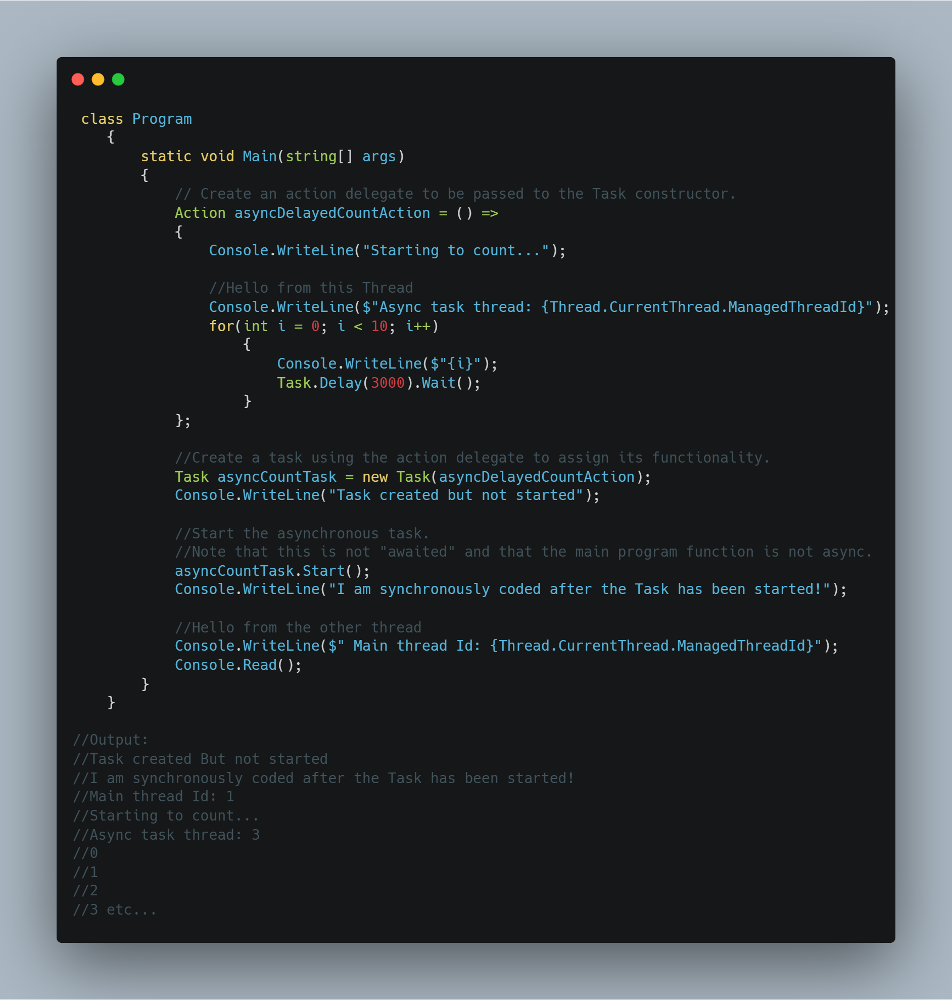

This code snippet displays a basic way to identify that a Task is an asynchronous method. In this case, it is not awaited using the 'await' keyword so it runs in the background using thread pooling. It also demonstrates that thread pooling causes a delay in the execution of the method.

